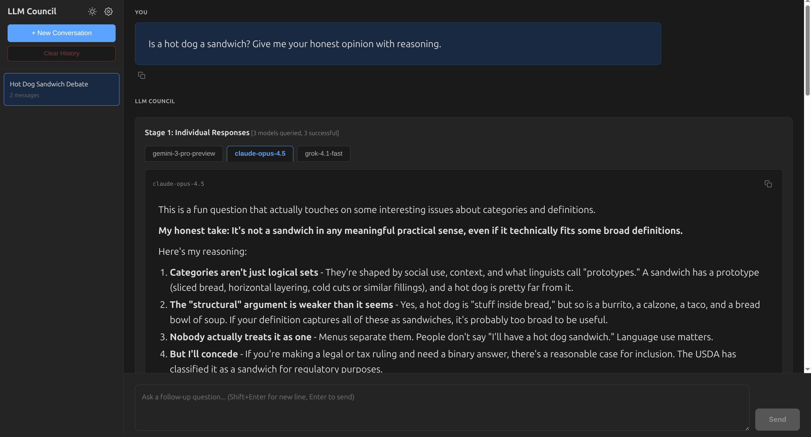
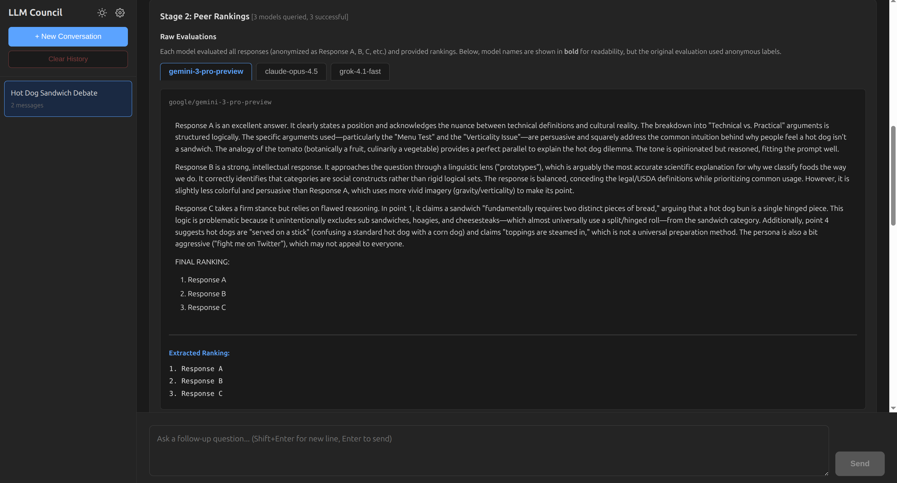
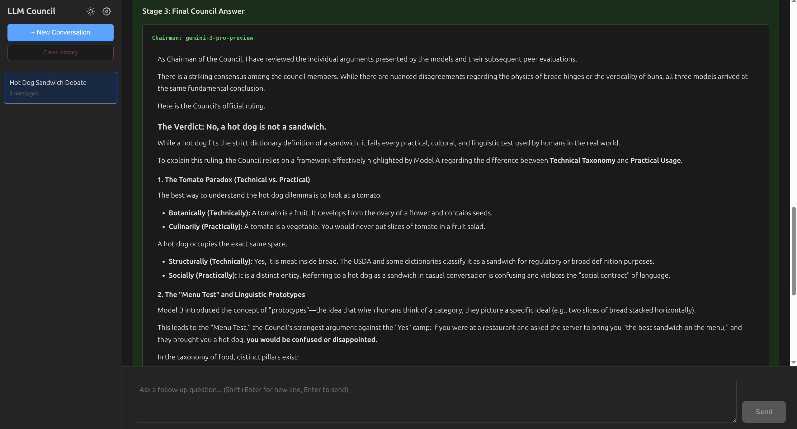
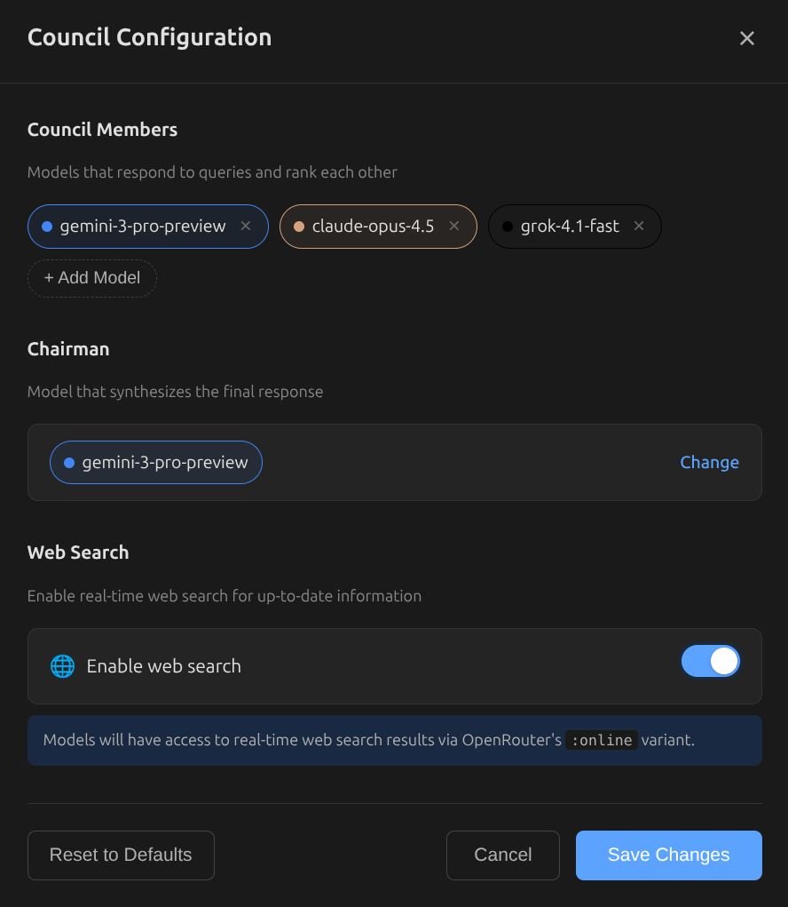
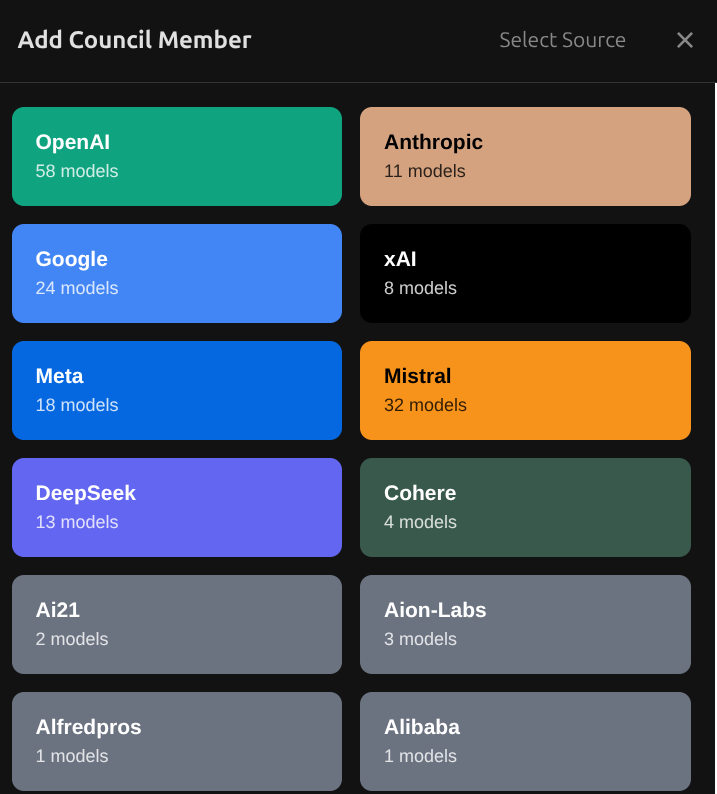
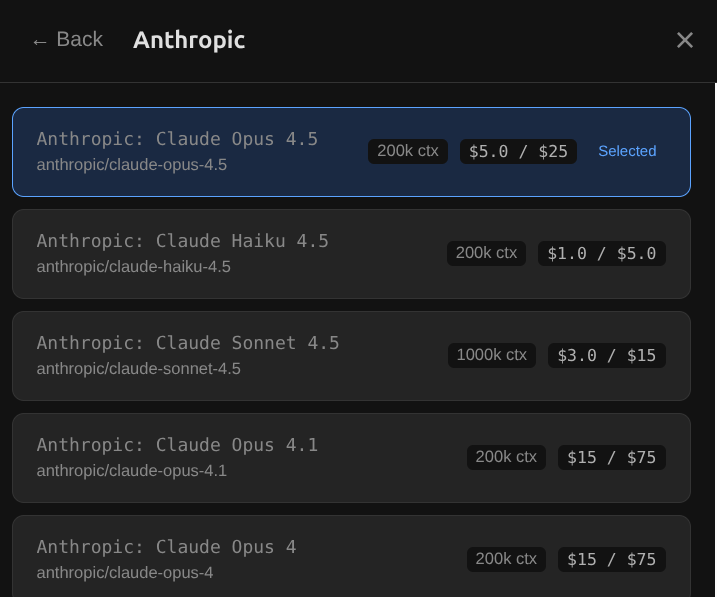

# LLM Council


The idea of this repo is that instead of asking a question to your favorite LLM provider (e.g. OpenAI GPT 5.1, Google Gemini 3.0 Pro, Anthropic Claude Sonnet 4.5, xAI Grok 4, eg.c), you can group them into your "LLM Council". This repo is a simple, local web app that essentially looks like ChatGPT except it uses OpenRouter to send your query to multiple LLMs, it then asks them to review and rank each other's work, and finally a Chairman LLM produces the final response.

In a bit more detail, here is what happens when you submit a query:

1. **Stage 1: First opinions**. The user query is given to all LLMs individually, and the responses are collected. The individual responses are shown in a "tab view", so that the user can inspect them all one by one.
2. **Stage 2: Review**. Each individual LLM is given the responses of the other LLMs. Under the hood, the LLM identities are anonymized so that the LLM can't play favorites when judging their outputs. The LLM is asked to rank them in accuracy and insight.
3. **Stage 3: Final response**. The designated Chairman of the LLM Council takes all of the model's responses and compiles them into a single final answer that is presented to the user.

## How It Works - Visual Walkthrough

Try asking the council a fun, controversial question like **"Is a hot dog a sandwich?"** to see how different AI models reason through subjective debates.

### Stage 1: Independent Responses

Each council member independently answers your question, showcasing different reasoning styles and perspectives.



### Stage 2: Anonymous Peer Review

Models evaluate and rank each other's responses without knowing who wrote what. This prevents bias and reveals which arguments are most compelling.



### Stage 3: Chairman Synthesis

The Chairman reviews all responses and rankings to produce a final, comprehensive answer that synthesizes the best insights.



### Configuration

Customize your council through the UI - add/remove members, choose your chairman, and enable web search for real-time information.



Models are auto-discovered from OpenRouter's API. Browse providers and select from hundreds of available models with pricing and context length info.





## Resources

[](https://deepwiki.com/eddiefleurent/llm-council)

**[Ask DeepWiki about this codebase](https://deepwiki.com/eddiefleurent/llm-council)** - AI-powered Q&A to understand the implementation, architecture, and code. Great for contributors or anyone curious about how the council system works under the hood.

## About This Fork

This is an actively maintained fork of [karpathy/llm-council](https://github.com/karpathy/llm-council). While the original was a weekend hack project, this fork adds production features, better UX, and ongoing improvements. See the [Changelog](#changelog) below for what's new.

The original concept by @karpathy remains brilliant: it's nice and useful to see multiple responses side by side, and the cross-opinions of all LLMs on each other's outputs provide valuable insights when evaluating model quality.

## Quick Start - Docker 🐳

The easiest way to run LLM Council is via Docker. The app is available as a pre-built image on Docker Hub.

### Using Docker Compose

```bash
# Clone the repository
git clone https://github.com/eddiefleurent/llm-council.git
cd llm-council

# Create and configure .env file
cp deploy/.env.example deploy/.env
nano deploy/.env  # Add your OPENROUTER_API_KEY

# Start the container
docker compose up -d

# Access at http://localhost:5173
```

### Using Docker Run

```bash
docker run -d \
  --name llm-council \
  -p 5173:5173 \
  -p 8001:8001 \
  -v ./data:/app/data \
  -e OPENROUTER_API_KEY=sk-or-v1-your-key-here \
  --restart unless-stopped \
  g0dfather/llm-council:latest
```

**Required**: `OPENROUTER_API_KEY` from [openrouter.ai](https://openrouter.ai/)
**Optional**: `GROQ_API_KEY` for voice transcription from [console.groq.com](https://console.groq.com/)

### Unraid Users

Install using the template or docker-compose. See [unraid/README.md](unraid/README.md) for detailed instructions.

---

For detailed deployment options, troubleshooting, and updates, see [deploy/README.md](deploy/README.md).

## Local Development Setup

### 1. Install Dependencies

The project uses [uv](https://docs.astral.sh/uv/) for project management.

**Backend:**
```bash
uv sync
```

**Frontend:**
```bash
cd frontend
pnpm install
cd ..
```

### 2. Configure API Keys

Create a `.env` file in the project root:

```bash
OPENROUTER_API_KEY=sk-or-v1-...
GROQ_API_KEY=gsk_...  # Optional: For voice transcription
```

Get your OpenRouter API key at [openrouter.ai](https://openrouter.ai/). Make sure to purchase the credits you need, or sign up for automatic top up.

For voice transcription (optional), get a free Groq API key at [console.groq.com](https://console.groq.com/). The app works without it, but the microphone button will show setup instructions.

### 3. Configure Models (Optional)

Models are configured through the **UI** using the gear icon in the sidebar. You can:
- Add/remove council members from any OpenRouter provider
- Select the chairman model
- Enable web search (`:online` variant) for real-time information
- Models are auto-discovered from OpenRouter's API

Configuration is saved to `data/council_config.json`. Default models are defined in `backend/config.py` as fallbacks.

## Running the Application

**Option 1: Use the start script**
```bash
./start.sh
```

**Option 2: Run manually**

Terminal 1 (Backend):
```bash
uv run python -m backend.main
```

Terminal 2 (Frontend):
```bash
cd frontend
pnpm run dev
```

Then open <http://localhost:5173> in your browser.

**Option 3: Use Make commands**
```bash
# Run both backend and frontend in parallel
make run

# Or run individually:
make run-backend   # Start backend only
make run-frontend  # Start frontend only
```

## Development Tools

The project includes several tools to maintain code quality:

### Make Commands

Run `make help` to see all available commands:

**Code Quality:**
```bash
make lint           # Check code with ruff linter
make lint-fix       # Auto-fix linting issues
make lint-unsafe    # Auto-fix including unsafe changes
make format         # Format code with ruff
make format-check   # Check formatting without changes
```

**Testing:**
```bash
make test           # Run pytest tests
make test-cov       # Run tests with coverage report
```

**Setup:**
```bash
make dev-install          # Install dev dependencies
make pre-commit-install   # Install pre-commit hooks
```

**Cleanup:**
```bash
make clean          # Remove cache and build artifacts
```

### Ruff Linter & Formatter

The project uses [Ruff](https://docs.astral.sh/ruff/) (v0.15.0) for fast Python linting and formatting:
- **Line length**: 88 characters (Black/Ruff standard)
- **Target**: Python 3.10+
- **Replaces**: flake8, black, isort, pyupgrade, and more
- **Configuration**: `pyproject.toml` under `[tool.ruff]`
- **Pre-commit hooks**: Automatically run linter and formatter before commits

To enable pre-commit hooks:
```bash
make pre-commit-install
```

## How Ranking Works

In **Stage 2**, council members rank each other's responses using two algorithms:

1. **Mean Position Averaging**: Each response's average position across all rankings (lower = better)
2. **Tournament-Style Pairwise (Condorcet)**: Head-to-head wins between responses (more robust to outliers)

Responses are anonymized as "Response A", "Response B", etc. to prevent bias. Models provide rankings in this format:

```text
FINAL RANKING:
1. Response C
2. Response A
3. Response B
```

Both ranking methods appear in the metadata, and the Chairman sees both when synthesizing the final answer in Stage 3.

## Changelog

Major improvements since forking from karpathy/llm-council:

- **Mobile Support** - Fully responsive design with hamburger menu navigation for phones and tablets
- **Chairman Direct Mode** - Toggle between full council deliberation and direct chairman chat for quick follow-up refinement
- **Voice Transcription** - Microphone button for speech-to-text input using Groq Whisper API
- **Dynamic Model Configuration** - Configure council/chairman via UI with auto-discovery from OpenRouter
- **Web Search Toggle** - Enable `:online` variant for real-time information access
- **Multi-turn Conversations** - Full conversation context with smart summarization
- **Error Handling** - Graceful degradation when models fail, detailed error reporting
- **Tournament Rankings** - Condorcet voting algorithm alongside mean position averaging
- **Model Pricing Display** - See pricing and context limits in model selector
- **DeepWiki Integration** - AI-powered codebase Q&A for understanding architecture and implementation
- **Copy to Clipboard** - One-click copy for responses across all stages
- **Context Indicator** - Visual feedback when using conversation history
- **Conversation Management** - Clear history, delete conversations, draft mode
- **Comprehensive Tests** - Unit and integration tests with pytest
- **Dark Mode** - Dark theme with toggle button
- **Ruff Linter** - Fast Python linting and formatting with pre-commit hooks
- **Make Commands** - Convenient Makefile for common development tasks

## Tech Stack

- **Backend:** FastAPI (Python 3.10+), async httpx, OpenRouter API
- **Frontend:** React + Vite, react-markdown for rendering
- **Storage:** JSON files in `data/conversations/`
- **Package Management:** uv for Python, pnpm for JavaScript
